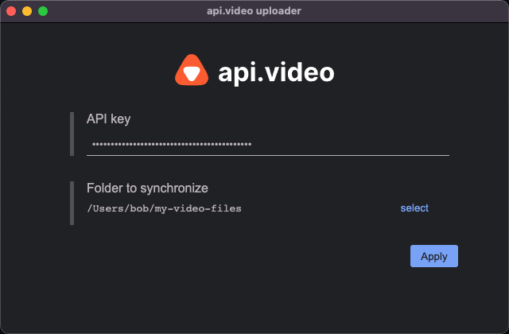
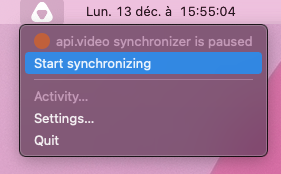
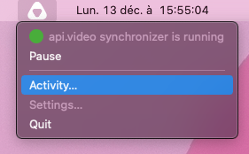

 &nbsp;  &nbsp; 

<h1 align="center">api.video video synchronization desktop application</h1>

[api.video](https://api.video) is the video infrastructure for product builders. Lightning fast video APIs for integrating, scaling, and managing on-demand & low latency live streaming features in your app.

# Table of contents
- [Table of contents](#table-of-contents)
- [Warning](#warning)
- [Project description](#project-description)
- [Getting started](#getting-started)
  - [Requirements](#requirements)
  - [Installation & first run](#installation--first-run)
- [Documentation](#documentation)
  - [What is meant by "synchronization"](#what-is-meant-by-synchronization)

# Warning

**This project is still in the testing phase. The applications proposed for download should be considered as alpha version.**

# Project description

This desktop application allows you to easily upload all the videos files stored in a given folder of your computer to api.video.

# Getting started

## Requirements

At the moment, the application is compatible with MacOS & Windows.

## Installation & first run

1) download the executable that matches your OS (currently MacOS & Windows are supported) here: [latest release](https://github.com/apivideo/api.video-desktop-synchronizer/releases/latest).
2) launch the executable (NOTE: at the moment, Windows executables are not signed, so you will probably have to accept some security warnings at the first run)
3) when you launch the app for the first time, the Settings window appears. Here, you'll have to enter your [api.video API key](https://dashboard.api.video/register), and the folder you want to watch:
   
       

4) once done, click on `Apply`. You can now lauch the synchronization by clicking on the api.video icon in your tray icons (next to the clock), and then on `Start synchronizing`:
   
       

5) To see what files have been or are beeing uploaded, click on `Activity`. You'll see the upload progress of all your uploads:
   
       

# Documentation

## What is meant by "synchronization"

Synchronization is a one-way process: the videos you add to the synchronized directory are sent to your api.video account. On the other hand: 
- if you delete a file from your synchronized folder, it won't be deleted from your api.video account,
- if you add a file in your api.video account by another way, it won't be downloaded in your synchronized folder
  
